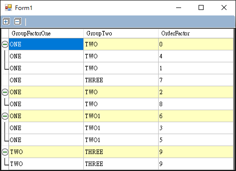
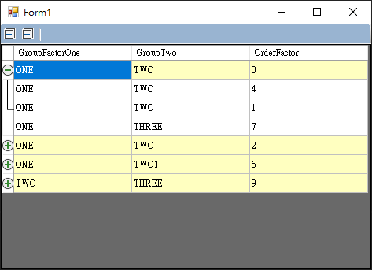

# GroupGridView (C#)

This is an Expandable/Collapsable grid view which extends DataGridView.

___

## Attribute

### GroupBy

`GroupByEnabled`: default true
> Determines if grouping behaviour is enabled.  If set to false, it will be a normal gridview.

`GroupByColumns`: default first column
> Add each column index which is required to match in order to form a group. The GroupBy Columns attribute grouping gridview that have the same values into groups of rows.

`GroupByColumnsOnlyBeforeUnderlineEnable`: default false
> Determine if the grouping gridview only compares the content before the underline.

`GroupByNonsequenceEnabled`: default true
> Determine if nonsequence row grouping is enabled.

`GroupByNullValueEnabled`: default false
> Determine if grouping for null value of columns is enabled.

### BaseRow

`BaseRowSingleGroupEnabled`: default false
> Determines if single group for 'Base' Rows is enabled.

`BaseRowGroupOrderColumn`: default -1
> Determines which column is used to order groups. This is necessary to identify the 'Base' row for each group. A value of -1 means that it relies on existing order.

`BaseRowGroupOrder`: default Ascending (Only effective when BaseRowGroupOrderColumn is set)
> Determines if Ascending or Descending order groups. Grouping order is based on the order column.

`BaseRowColorEnabled`: default true
> Determines if defines a Color for 'Base' Rows is enabled.

`BaseRowColor`: default White (Only effective when BaseRowColorEnabled is true)
> Defines a Color for 'Base' Rows in groups.

`BaseRowColorInterleaved`: default false
> Determines if to make the group list color interleaved.

### RowHeaders

`RowHeadersCollapse`: default built-in collapse image
> Defines a Collapse image of 'Base' Rows in groups.

`RowHeadersExpand`: default built-in expand image
> Defines a Expand image of 'Base' Rows in groups.

`RowHeadersSeparaterWireEnabled`: default true
> Determines if separater wire for row headers of each group is enabled.

`RowHeadersSeparater`: default built-in separater image
> Defines a Separater image for RowHeaders in groups.

`RowHeadersSeparaterEnd`: default built-in separaterEnd image
> Defines a SeparaterEnd image for RowHeaders in groups.

### TopLeftHeader

`TopLeftHeaderButtonEnabled`: default true
>Determines if CollapseExpandAll button for TopLeft Header is enabled.

`TopLeftHeaderCollapseAll`: default built-in collapseA image
>Defines a CollapseAll image for TopLeft Header.

`TopLeftHeaderExpandAll`: default built-in expandAll image
>Defines a ExpandAll image for TopLeft Header.
___

## Reference：

* [Expanding-Collapsing-Data-Grid-View](https://www.codeproject.com/Tips/1066176/Expanding-Collapsing-Data-Grid-View)
